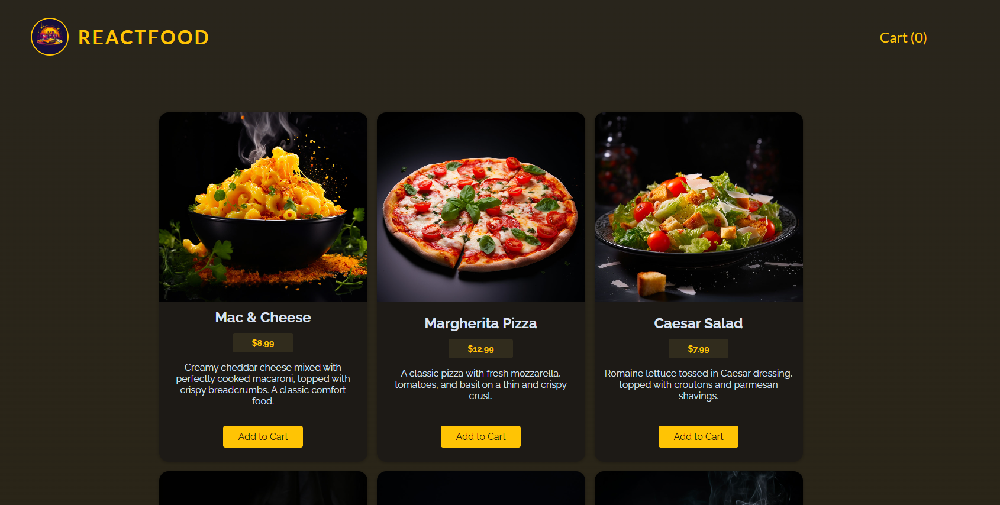

# Food-app

- **Description:** This is a food ordering app where you can browse delicious meals, pick your favorite dishes, add them to your cart, and complete the order by filling out a simple form. Enjoy a seamless and easy way to get your favorite food delivered!
  
- **Features:**
  - React Frontend
  - Node.js Backend
- **How to run:**

  1.  Navigate to the project folder:
      ```bash
      cd finalCountDown
      ```
  2.  Install dependencies:
      ```bash
      npm install
      ```
  3.  Start the development server:
      ```bash
      npm start
      ```
  4.  Navigate to the project back-end folder:
      ```bash
      cd backend
      ```
  5.  Start the backend server:
      ```bash
      node app.js
      ```
  6.  Open your browser and go to `http://localhost:3000`.

---

## General Setup Instructions

For any of these projects:

1. Make sure you have **Node.js** and **npm** installed on your system.
2. Navigate to the desired project folder, install dependencies, and start the development server using the commands mentioned above.

Enjoy exploring the projects! 🎉
