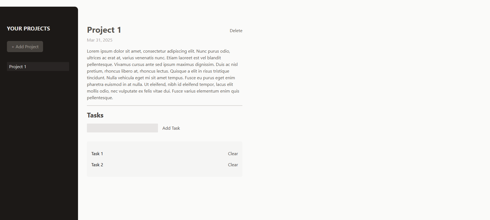

# Management task

- **Description:** Easily manage your projects and tasks with this simple yet powerful project management app. Stay on top of your work by creating projects, adding tasks, and tracking progress effortlessly.
  
- **Features:**
  - Create & Manage Projects
  - Task Management
  - Project Deletion
- **How to run:**
  1.  Navigate to the project folder:
      ```bash
      cd finalCountDown
      ```
  2.  Install dependencies:
      ```bash
      npm install
      ```
  3.  Start the development server:
      ```bash
      npm start
      ```
  4.  Open your browser and go to `http://localhost:3000`.

---

## General Setup Instructions

For any of these projects:

1. Make sure you have **Node.js** and **npm** installed on your system.
2. Navigate to the desired project folder, install dependencies, and start the development server using the commands mentioned above.

Enjoy exploring the projects! 🎉
